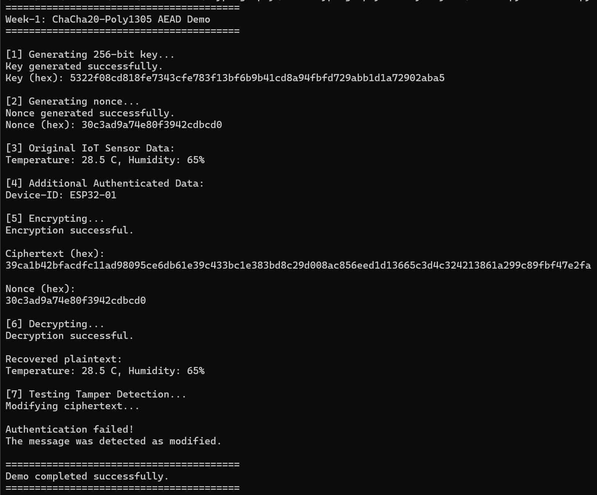

# Week-1 — ChaCha20-Poly1305 AEAD Implementation for Low-Power Embedded Devices

## 1. Week-1 Objective

This Week-1 project is a **simple, beginner-friendly demonstration** of
**ChaCha20-Poly1305 AEAD encryption** in Python. The long-term goal is to
eventually adapt authenticated encryption for use on low-power embedded /
IoT devices, but this week's project is a **pure Python software
demonstration only** — no hardware, no microcontrollers, no networking.

It demonstrates:

1. Key generation (256-bit key)
2. Nonce generation
3. Plaintext encryption
4. Authentication tag generation
5. Ciphertext generation
6. Decryption
7. Authentication verification
8. Detection of modified/tampered ciphertext
9. Why AEAD (Authenticated Encryption with Associated Data) matters

## 2. What is ChaCha20-Poly1305?

ChaCha20-Poly1305 is an **AEAD** (Authenticated Encryption with Associated
Data) algorithm made of two parts working together:

- **ChaCha20** — a stream cipher. It takes your secret key, a nonce, and
  your plaintext, and produces scrambled **ciphertext**. This gives
  **confidentiality**: nobody without the key can read the original
  message.

- **Poly1305** — a message authentication code (MAC). It produces a short
  **authentication tag** based on the ciphertext (and any Additional
  Authenticated Data). This gives **integrity/authentication**: if even a
  single bit of the ciphertext (or the associated data) changes, the tag
  will no longer match, and the receiver knows the message was tampered
  with or corrupted.

Put together, "AEAD" means you get both properties at once:

- **Confidentiality** — the message content is hidden.
- **Integrity** — you can tell if the message was changed.
- **Authentication** — you can tell the message was created by someone who
  has the correct key (assuming the key is kept secret).

This project does **not** implement ChaCha20 or Poly1305 from scratch.
Instead, it uses the well-tested, audited implementation from Python's
`cryptography` library.

## 3. Why is it useful for IoT / Embedded Systems?

Sensor devices (e.g. temperature/humidity sensors) often send small
amounts of data over networks that are easy to intercept or tamper with.
Authenticated encryption solves two problems at once:

- Keeps sensor readings private (confidentiality).
- Lets the receiver detect if the data was altered or forged in transit
  (integrity/authentication) — for example, by an attacker trying to
  inject fake sensor readings.

A simple mental model of the flow used in this project:

```text
Sensor → Encryption → Network → Decryption → Receiver
```

**Note:** This Week-1 implementation is a **software-only demonstration**
running on a regular computer. It is **not yet running on an actual
microcontroller** such as an ESP32 or Raspberry Pi Pico — that would be a
later step.

## 4. Project Structure

```text
Week-1/
│
├── README.md                     <- This file
├── requirements.txt               <- Python dependencies (just `cryptography`)
├── main.py                        <- Runs the full demonstration
├── chacha20_poly1305.py           <- Core encrypt/decrypt helper functions
├── test_chacha20_poly1305.py      <- Unit tests (unittest)
├── .gitignore                     <- Files/folders to exclude from git
└── screen-shots/
    └── week-1-sc.png               <- Example terminal output (see below)
```

- **`chacha20_poly1305.py`** — contains simple, well-commented functions:
  `generate_key()`, `generate_nonce()`, `encrypt_message()`,
  `decrypt_message()`.
- **`main.py`** — a runnable script that ties everything together and
  prints a step-by-step demonstration, including a tampering test.
- **`test_chacha20_poly1305.py`** — automated tests that check encryption,
  decryption, AAD handling, and tamper detection all work correctly.

## 5. Installation

Check your Python version (Python 3.8+ recommended):

```bash
python --version
```

Create a virtual environment:

```bash
python -m venv venv
```

Activate it.

**Windows (Command Prompt / PowerShell):**

```bash
venv\Scripts\activate
```

**Linux / macOS:**

```bash
source venv/bin/activate
```

Install dependencies:

```bash
pip install -r requirements.txt
```

## 6. How to Run

From inside the `Week-1` folder, with the virtual environment activated:

```bash
python main.py
```

This runs the entire demonstration automatically: key generation, nonce
generation, encryption, decryption, and the tampering test.

## 7. How to Run Tests

```bash
python -m unittest test_chacha20_poly1305.py
```

You should see output like:

```text
.....
----------------------------------------------------------------------
Ran 5 tests in 0.01s

OK
```

## 8. Expected Output

Running `python main.py` should print something similar to:

```text
========================================
Week-1: ChaCha20-Poly1305 AEAD Demo
========================================

[1] Generating 256-bit key...
Key generated successfully.
Key (hex): <random hex string>

[2] Generating nonce...
Nonce generated successfully.
Nonce (hex): <random hex string>

[3] Original IoT Sensor Data:
Temperature: 28.5 C, Humidity: 65%

[4] Additional Authenticated Data:
Device-ID: ESP32-01

[5] Encrypting...
Encryption successful.

Ciphertext (hex):
<random hex string>

Nonce (hex):
<random hex string>

[6] Decrypting...
Decryption successful.

Recovered plaintext:
Temperature: 28.5 C, Humidity: 65%

[7] Testing Tamper Detection...
Modifying ciphertext...

Authentication failed!
The message was detected as modified.

========================================
Demo completed successfully.
========================================
```

Every run will show different random hex values for the key, nonce, and
ciphertext — that's expected and correct.

Here is an actual screenshot of a real run:



## 9. Sample Run (Screenshot)

Here is a real terminal output from running `python main.py`, showing
successful encryption, decryption, and tamper detection:


## 10. Tampering Demonstration

In Step 7, the program deliberately flips the bits of the first byte of
the ciphertext, simulating an attacker (or network glitch) corrupting the
message in transit. When decryption is attempted on this modified
ciphertext:

- Poly1305's authentication check fails.
- The `cryptography` library raises an `InvalidTag` exception.
- `main.py` catches this exception cleanly (no ugly crash/traceback) and
  prints:

  ```text
  Authentication failed!
  The message was detected as modified.
  ```

This is the core benefit of AEAD: **you cannot decrypt tampered data
without being told it was tampered with.**

## 11. Security Notes

- **Never reuse a nonce with the same key.** Doing so can leak information
  about the plaintexts and, in the worst case, allow an attacker to forge
  messages. Always generate a fresh, random nonce for each encryption.
- **Do not hard-code production encryption keys** in source code. This
  project generates a new random key every time it runs, purely for
  demonstration purposes.
- **Keep encryption keys secret.** Anyone with the key (and nonce) can
  decrypt your messages.
- **AAD (Additional Authenticated Data) is authenticated but not
  encrypted.** It is protected against tampering, but it is visible to
  anyone who sees the message — don't put secrets in it.
- **ChaCha20-Poly1305 provides both confidentiality and integrity** — that
  is what makes it an AEAD algorithm, rather than "just" encryption.

## 12. Embedded/IoT Connection (Future Work)

This Week-1 project is a pure Python, desktop-only demonstration. In later
weeks, the same core ideas (key, nonce, AAD, encrypt, decrypt, verify)
could be adapted for low-power embedded devices such as:

- **ESP32** (which has hardware crypto acceleration and MicroPython
  support)
- **Raspberry Pi Pico** (and Pico W, for networking)
- Other low-power microcontrollers with cryptographic libraries available

Adapting this to real hardware would involve additional considerations
not covered this week, such as: how to securely generate/store keys on a
constrained device, how to synchronize nonces between sender and
receiver, power/performance limitations, and the actual transport
mechanism (e.g. Wi-Fi, LoRa, BLE) used to send the encrypted data. **None
of that hardware work is implemented yet** — this week is software-only,
by design.
