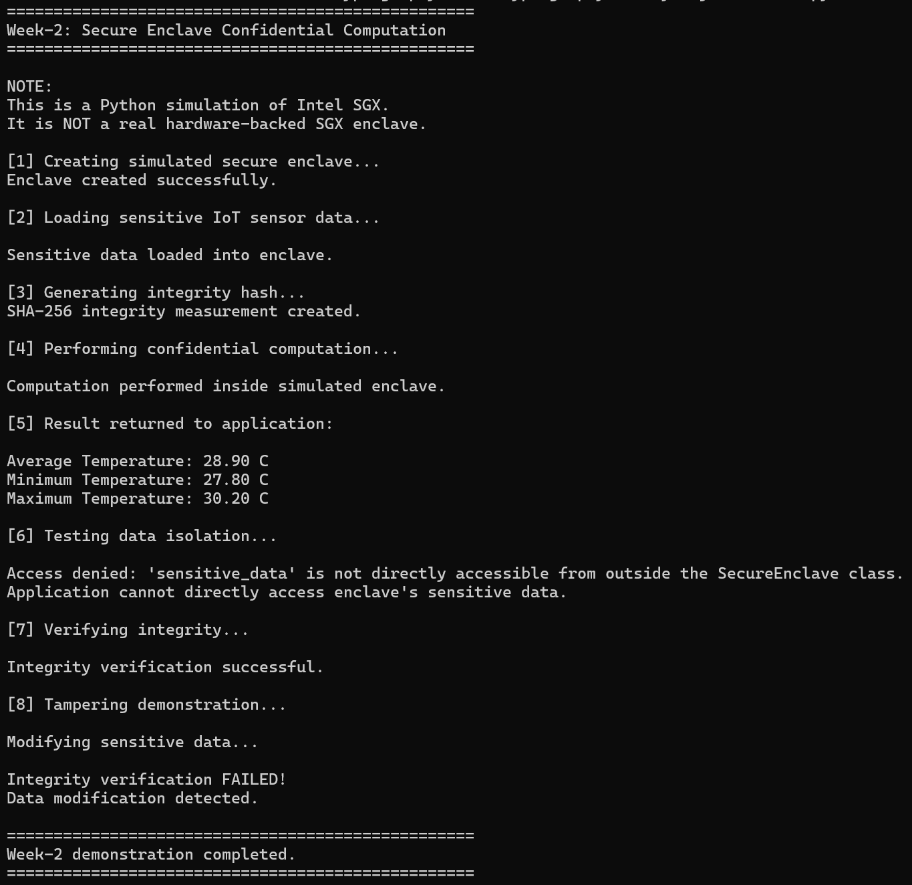
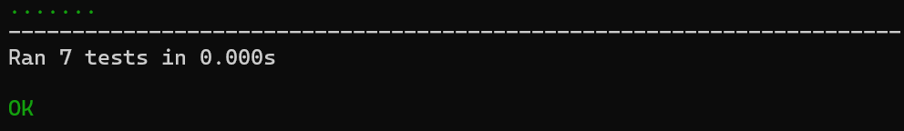

# Week-2 — Demo Screenshots

This file shows sample terminal output from the Week-2 Secure Enclave
(Intel SGX simulation) project, for quick reference. For the full project
explanation, setup instructions, and disclaimers, see the main
[README.md](README.md).

---

## 1. Running the demonstration (`python main.py`)

The screenshot below shows the full 8-step demonstration: creating the
simulated enclave, loading sensitive IoT sensor data, generating a SHA-256
integrity hash, performing confidential computation, confirming that direct
access to the sensitive data is blocked, verifying integrity, and finally
detecting tampering after the data is modified.

---

## 2. Running the unit tests (`python -m unittest test_secure_enclave.py`)

The screenshot below shows all 7 unit tests passing successfully.

---

**Reminder:** as explained in the main [README.md](README.md), this project
is an educational Python **simulation** of the Intel SGX programming model.
It does not provide real hardware-backed enclave isolation or genuine SGX
security guarantees.
