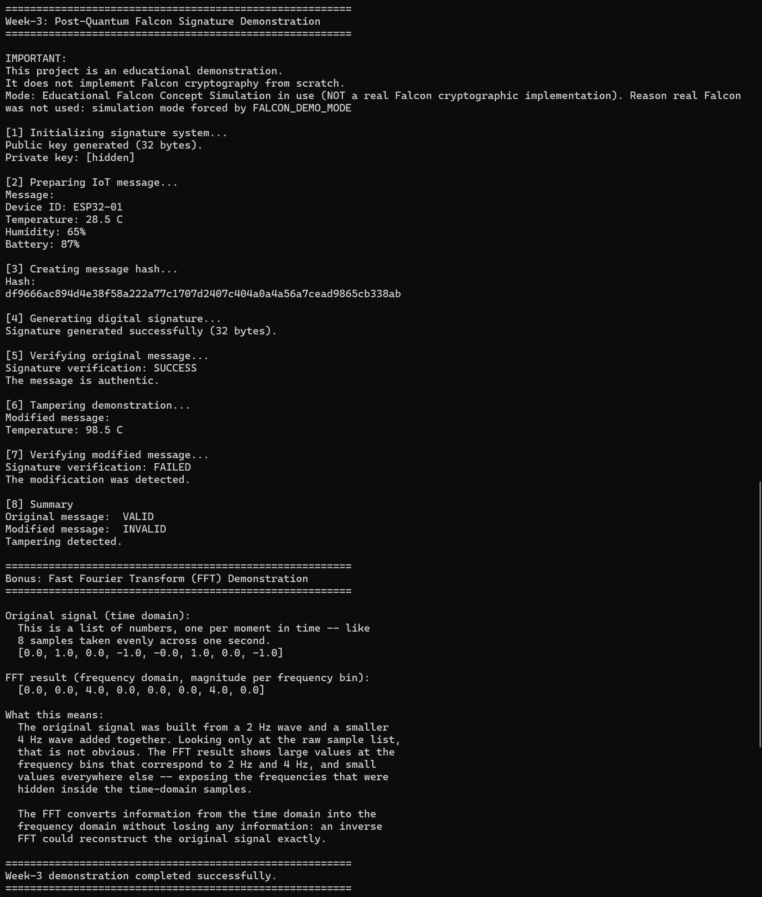

# Week-3 — Sample Run Output

This file shows a sample run of the **Week-3: Post-Quantum Falcon Signature
Demonstration** project, so you can see what to expect before running it
yourself.

> For full setup instructions, prerequisites, and an explanation of the
> concepts (post-quantum cryptography, lattices, Falcon, FFT), see the
> main [`README.md`](./README.md) in the project root.

---

## Sample Terminal Output

The screenshot below shows the project running with
`FALCON_DEMO_MODE=simulation`, which uses the fast, clearly-labelled
**Educational Falcon Concept Simulation** instead of building the real
Falcon library — useful for a quick first look without installing any
system build tools.



---

## What the Output Shows

1. **Mode banner** — states plainly that the simulation is active (not real
   Falcon), and why.
2. **Key initialization** — a public key is generated; the private key is
   never printed (`[hidden]`).
3. **Sample IoT message** — a small sensor reading (`Device ID`,
   `Temperature`, `Humidity`, `Battery`) is prepared.
4. **Hashing** — the message is hashed with SHA-256.
5. **Signing** — a digital signature is generated over the message.
6. **Verification (original message)** — the signature checks out:
   `SUCCESS`.
7. **Tampering** — the `Temperature` field is changed (`28.5 C` →
   `98.5 C`), but the *original* signature is kept unchanged.
8. **Verification (tampered message)** — verification correctly
   `FAILED`, proving the tampering was detected.
9. **Summary** — original message `VALID`, modified message `INVALID`.
10. **Bonus FFT demo** — a small signal is transformed with
    `numpy.fft.fft`, showing the time-domain samples converted into their
    frequency-domain magnitudes.

---

## Reproducing This Output

```bash
cd Week-3
pip install -r requirements.txt
FALCON_DEMO_MODE=simulation python main.py
```

To see the same workflow using **real Falcon-512** instead of the
simulation (requires `cmake`, a C compiler, `git`, and OpenSSL dev
headers — see the main README's Installation section):

```bash
python main.py
```

The only difference in the output will be the mode banner at the top, and
the key/signature byte sizes (Falcon-512 keys and signatures are larger
than the 32-byte simulation values shown above).
